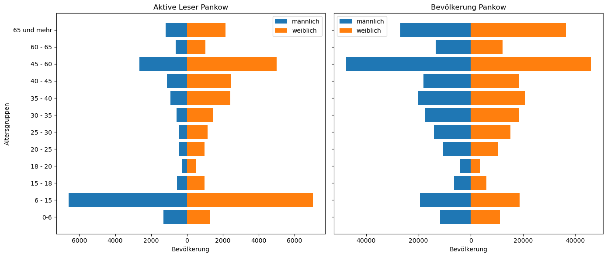
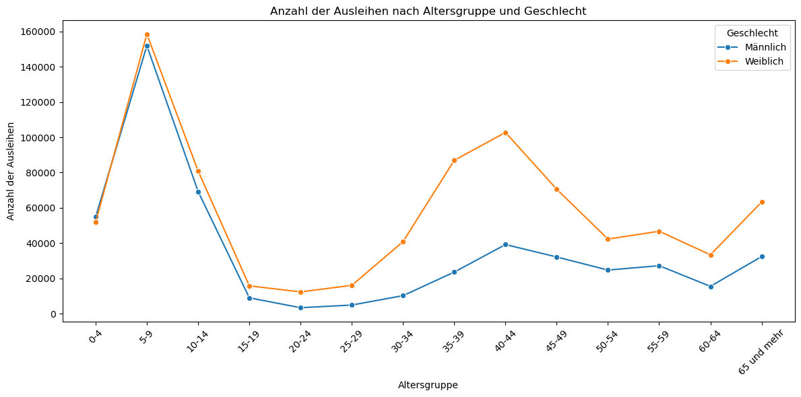
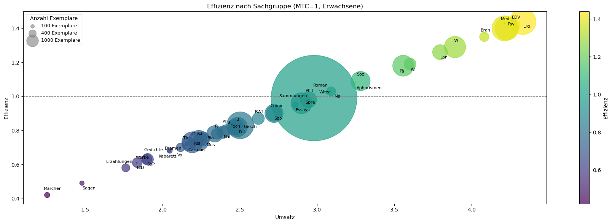
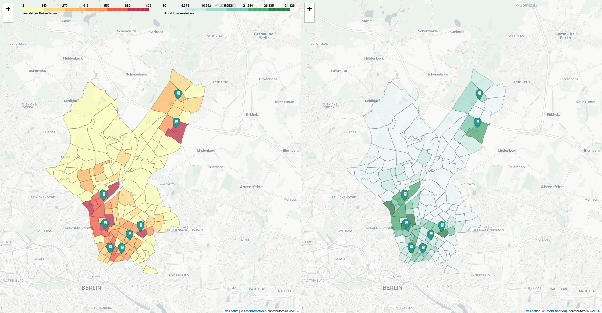
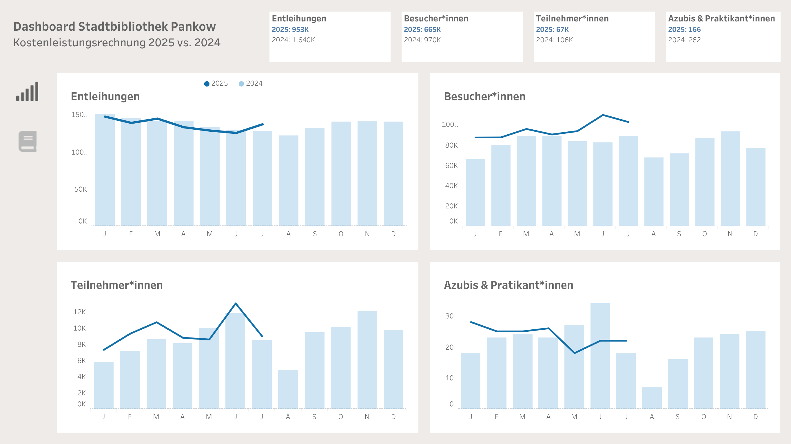

# Stadtbibliothek Pankow: What librarians have always wanted to know?

## 📌 Project Overview
This project analyzes data from the public libraries of Pankow (Berlin) to explore user behavior, collection management, and library performance.  
It demonstrates how data-driven insights can support decision-making and strategic development in public libraries.  

## 🎯 Objectives
- Provide an overview of user profiles  
- Disprove common assumptions about collection management  
- Explore spatial patterns through data mapping  
- Evaluate the collection with key performance indicators (KPI)  
- Present a dashboard as a tool for library management  

## 🛠️ Tools & Methods
- **Languages & Libraries**: Python (Pandas, NumPy, Matplotlib, Seaborn), SQL  
- **Visualization**: Tableau, Jupyter Notebook  
- **Techniques**: Data cleaning, exploratory data analysis, geospatial mapping, KPI evaluation, dashboard design  

## 📊 Key Insights (examples)
- Borrowing habits differ significantly across age groups.  
- Spatial analysis reveals library usage varies strongly by neighborhood.  
- Collection performance can be assessed through KPIs, supporting more efficient management.

## 📈 Data Insights

## 🗺️ Interactive Map

👉 Click on the image or [here](https://beatricem476.github.io/Final-project/dualmap_nutzer_prets.html) to explore the full interactive map.

## 📊 Interactive Dashboard

👉 Click on the image or [here](https://public.tableau.com/views/DashboardStadtbibliothekPankow/KLR2?:language=de-DE&:sid=&:redirect=auth&:display_count=n&:origin=viz_share_link) to explore the interactive Tableau dashboard.

